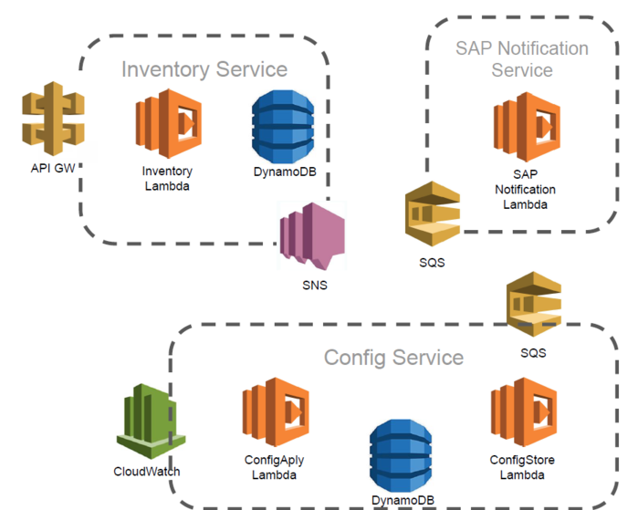
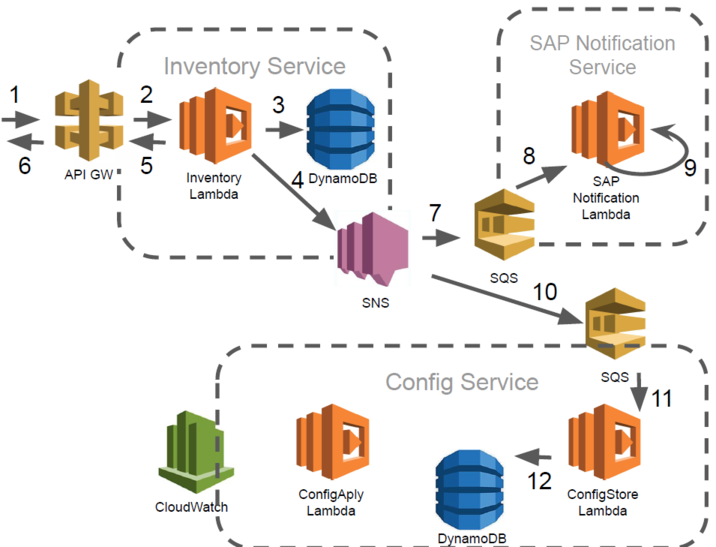

# AWS Device Management

This repository shows the implementation of a microservice architecture using the serverless design pattern to manage devices. The device creation uses multiple services, which are fully decoupled and do not block each other. The architecture is also able to handle multiple parallel requests. The system performs the following tasks:
  - Receive and store device information
  - Inform SAP (exterior system) system of newly created devices
    - The SAP system has a latency of 10 seconds, this long latency **does not** affect the device operation due to the decoupled nature of the architecture
    - Service-skeleton
  - Send configuration to device 
    - Service-skeleton
  - Device wakes up every hour once

## Serverless Architecture



### AWS services explored

- API Gateway
- Lambda functions (using both the golang runtime and the nodejs)
- Simple Queue Service
- Simple Notification Service
- DynamoDB
- CloudWatch (for logs and periodic triggers)
- Cloudformation (the project is entirely deployed using this tool)
- S3 storage
- IAM (Defining roles and permission ensuring a "need to use" policy for the services above)

### Some highlights
- Lambda developed using:
  - Golang
    - [configuration/apply](configuration/apply/main.go)
    - [configuration/store](configuration/store/main.go)
  - nodeJS
    - [inventory](inventory/index.js)
    - [Dummy SAP Integration](sap/index.js)
- HTTPs ReST API exposed via API GW.
- Event based internal communication
- SNS to Fan-Out events
- SQS for _guaranteed_ delivery even if a service is down
- Periodic configuration application triggered by CloudWatch event.
- Each microservice owns its own data/DynamoBD table.


## Data Flows/API
### Create Device



1. POST /dev/inventory `{"name":"device"}`
2. Forward request to lambda
3. Store data on table
4. Push DeviceCreated Event 
`{"type":"DeviceCreated",
"name":"device",
"deviceId":"1ad062ec-5469-40ba-a8ae-183109047edc"}`
5. Response http status 201
`{"deviceId":"1ad062ec-5469-40ba-a8ae-183109047edc"}`
6. Forward lambda response
7. Push DeviceCreated Event
8. Forward request to lambda
9. SAP Notification simulated by sleeping 10s (Stack parameter)
10. Push DeviceCreated Event
11. Forward request to
12. Store data on table

### Other methods

- PUT /dev/inventory/<deviceId> -d `{"name":"device"}`
  - Update device name, generates no events 
  - Responses: 200, if successful. 404, if device not found.

- GET /dev/inventory/<deviceId>
  - Get a device using the deviceId, generates no events.
  - Responses: 200, if successful. 404, if device not found.
  - `{"name":"deviceName", "deviceId":"uuid"}`

- GET /dev/inventory/
  - Get listing of all devices, generates no events.
  - Responses: 200, if successful.
  - `{"inventory":[{"name":"deviceName", "deviceId":"uuid"}, ..]}`

- DELETE /dev/inventory/<deviceId>
  - Delete a device using the deviceId, generates a DeviceDeleted event.
  - Responses: 200, if successful. 404, if device not found.

## Running the demo

In order to run clone this repository, cd into it and follow the instructions:

### 1. Prepare the lambdas 
  - **OPTIONAL** Compile code (only required for golang)
    - `GOOS=linux go build -o configuration/apply/lambda-handler ./main.go`
    - `GOOS=linux go build -o configuration/store/lambda-handler ./main.go`
  - Pre compiled for convenience, source available on the same folder:
    - [configuration/apply](configuration/apply/main.go)
    - [configuration/store](configuration/store/main.go)
  - Init the npm nodeJS dir
    ```bash
    cd inventory
    npm init -y 
    npm install
    cd ..
    ```

### 2. Create a S3 bucket that will hold the code
  ```bash 
  aws s3 mb s3://<BUCKET_NAME_HERE>
  ```
### 3. Package the solution
  - Push code to S3
  - Outputs a new yaml file with the S3 locations instead of local paths
  - Remember to replace the bucket name below
  ```bash 
  aws cloudformation package \
    --template-file init.yaml \
    --s3-bucket <BUCKET_NAME_HERE> \
    --output-template-file output.yaml
  ```
### 4. Deploy the stack
  ```bash
  aws cloudformation deploy \
    --stack-name devicesDeploy \
    --template-file output.yaml \
    --capabilities CAPABILITY_IAM \
    --parameter-overrides \
    sapNotificationDuration=10000  \
    configurationApplyLambdaRate="rate(1 minute)"
  ``` 
### 5. Wait a bit…

### 6. Get the API URL
  ```bash
  export URL=$(aws cloudformation describe-stacks \
    --stack-name devicesDeploy \
    --query "Stacks[0].Outputs[?OutputKey=='inventaryApiURL'].OutputValue" \
    --output text)
  echo "The API URL id is ${URL}"
  ```
### 7. Create a new device
  ```bash
  export DEVICE_ID=$(curl "${URL}" -d '{"name":"NamedDevice1"}' | jq -r .deviceId) 
  echo "The new device id is ${DEVICE_ID}"
  ```
### 8. List devices
  - List all devices
  ```bash
  curl -qs "${URL}" | jq
  ```
  - List the newly created device
  ```bash 
  curl -qs "${URL}"/"${DEVICE_ID}" | jq
  ```

### 9. Delete a device
  ```bash 
  curl -i -XDELETE "${URL}"/"${DEVICE_ID}"
  ```

### 10. Confirm the logs
  - Using the Cloudwatch web interface

### 11. Delete the deployment
  ```bash 
  aws cloudformation delete-stack \
    --stack-name devicesDeploy
  ```

